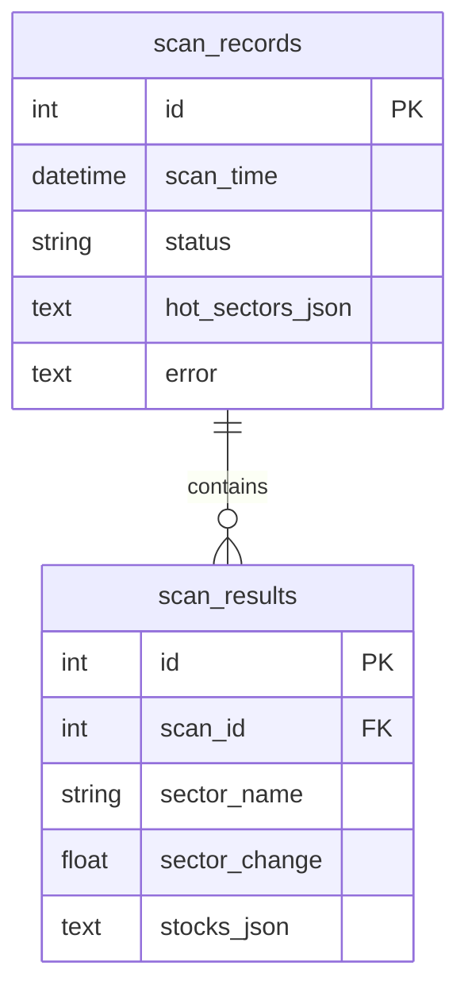
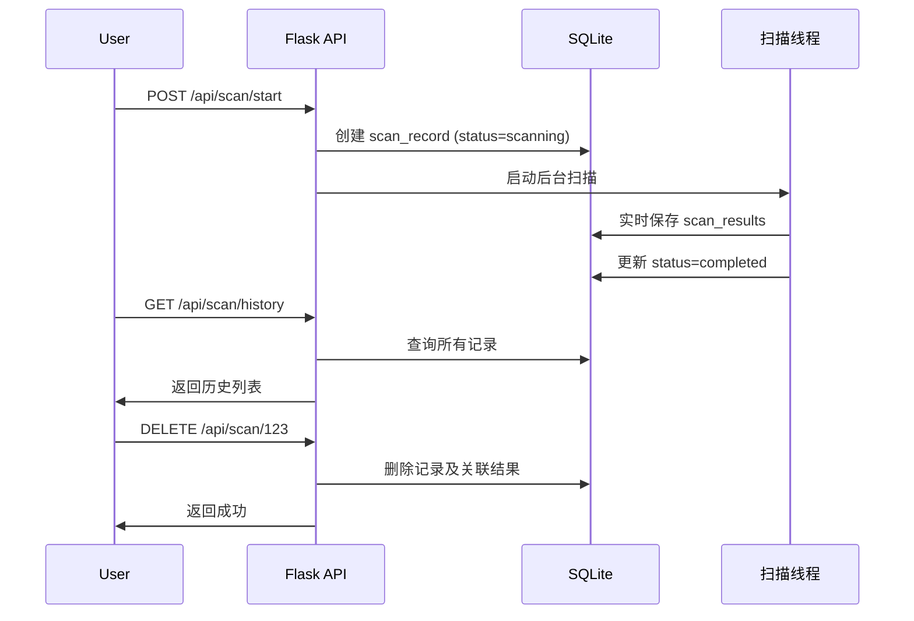

# SQLite 数据存储实现方案

## 1. 数据库设计

创建新文件 `database.py`，包含数据库初始化和操作逻辑。

### 表结构



- **scan_records**: 扫描记录主表，存储每次扫描的元信息
- **scan_results**: 扫描结果表，按板块存储股票分析结果

## 2. 核心模块 `database.py`

```python
# 主要功能
- init_db(): 初始化数据库表
- create_scan_record(): 创建新的扫描记录
- update_scan_status(): 更新扫描状态
- save_sector_result(): 保存板块扫描结果
- get_scan_list(): 获取扫描记录列表
- get_scan_detail(): 获取单次扫描详情
- delete_scan(): 删除指定扫描记录
```

## 3. API 接口修改

修改 [app.py](app.py)，新增/调整以下接口：

| 接口 | 方法 | 说明 |

|------|------|------|

| `/api/scan/history` | GET | 获取历史扫描记录列表 |

| `/api/scan/<id>` | GET | 获取指定扫描的详细结果 |

| `/api/scan/<id>` | DELETE | 删除指定扫描记录 |

原有接口调整：

- `/api/scan/start` - 扫描开始时创建数据库记录
- `/api/scan/results` - 从数据库读取最新一次扫描结果

## 4. 数据流程



## 5. 文件变更清单

- **新增**: `database.py` - 数据库模块
- **修改**: `app.py` - 集成数据库操作，新增 API
- **修改**: `templates/index.html` - 添加历史记录展示和删除功能
- **新增**: `data/stock.db` - SQLite 数据库文件（自动创建）

## 6. 实现细节

### 数据库文件位置

```
facSstock/
├── data/
│   └── stock.db    # SQLite 数据库
├── database.py     # 数据库操作模块
└── ...
```

### 关键代码片段

扫描时保存结果到数据库：

```python
# 在 run_scan() 中
scan_id = create_scan_record()  # 创建记录
# ... 扫描逻辑 ...
save_sector_result(scan_id, sector_name, sector_change, stocks)
update_scan_status(scan_id, 'completed')
```

查询历史记录：

```python
# 新增 API
@app.route('/api/scan/history')
def get_scan_history():
    records = get_scan_list(limit=20)
    return jsonify({'success': True, 'data': records})
```